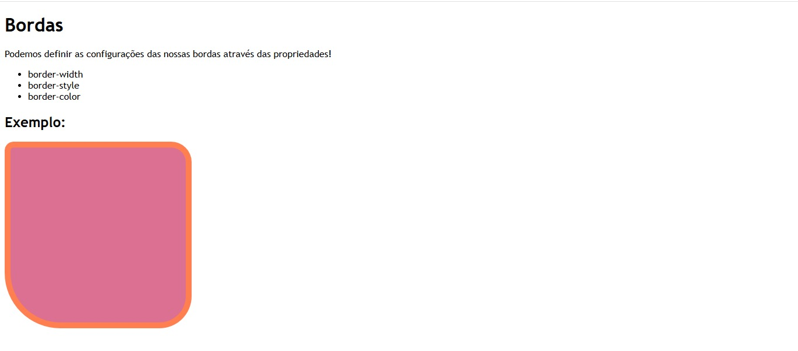
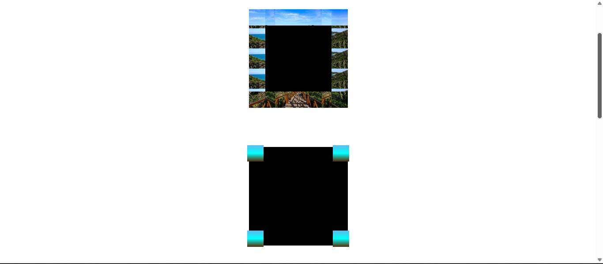

# HiHappy

Este projeto foi desenvolvido como parte dos desafios práticos da **DIO (Digital Innovation One)**. O objetivo é treinar habilidades em **HTML5** e **CSS3** construindo uma página moderna e responsiva.

## 🚀 Tecnologias utilizadas

- HTML5
- CSS3

## 🎯 Objetivo

Criar uma landing page visualmente atrativa, com estrutura semântica e foco em boas práticas de CSS.

## 📸 Preview

> *Adicione aqui um print do site ou um link do GitHub Pages, se publicado.*





## 💻 Como usar

1. Clone o repositório:
```bash
git clone https://github.com/Alison180077/Dio-hihappy-css.git
